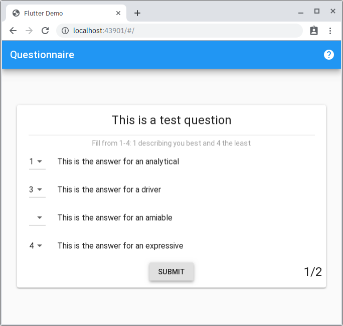
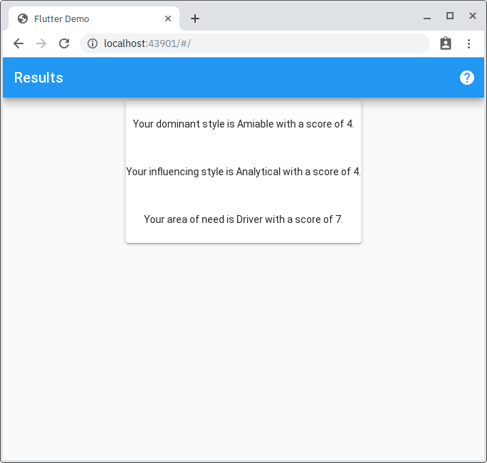

# Flutter Questionnairre

Simple questionnaire app I made for a friend using the BLoC pattern. Takes a JSON of questions, users rank 1-4 and then presented with a tally at the end.

Tested for Flutter for Web, and Android.

Follows BLoC pattern except that the question widget is a stateful widget since I thought the answer order randomization would be easier that way.

## Todos

 * Make results page prettier
 * Save progress when user leaves unfinished
 * Save to QR code?
